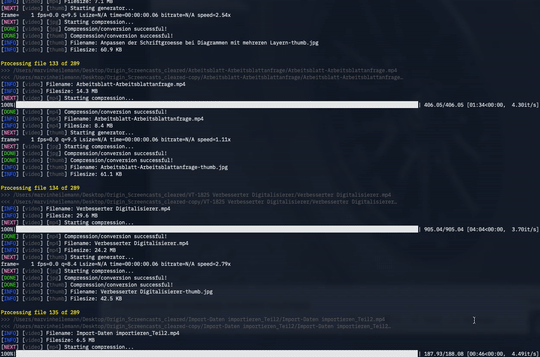

# Bulk Optimization

Convert and optimize any file in a directory and their children's into web compatible
formats, fast.

Suggestions and optimizations are highly appreciated! This is in the very beginning and
should help companies produces web save content without the pain.

- [Usage](#usage)
- [What happens?](#what-happens)
  - [Video files](#video-files)
  - [Images](#images)
  - [GIF](#gif)
  - [Other files](#other-files)
- [Development](#development)
- [Next](#next)
- [Reads](#reads)



## Usage

> Use `python3 cli.py --help` to view the below

```
usage: cli.py [-h] [-v] [--license] [--slugify [BOOL]]
              [--skip-existing [BOOL]] [--gif [BOOL]] [--copy [BOOL]]
              [--image-formats LIST [LIST ...]]
              [--video-formats LIST [LIST ...]] [--thumbnail [BOOL]]
              [--vtt [BOOL]]
              [input] [output]

Iterate over a directory and perform compression, resizing and formatting
for optimal web capabilities.

positional arguments:
  input                 folder to iterate over (default: current dir)
  output                destination folder (default: `-copy` added to input
                        folder)

optional arguments:
  -h, --help            show this help message and exit
  -v, --version         show program's version number and exit
  --license             show program's license
  --slugify [BOOL]      slugify filenames (default: True)
  --skip-existing [BOOL]
                        skip existing processed files (default: True)
  --gif [BOOL]          process GIF´s (default: False)
  --copy [BOOL]         copy not processable files (default: False)
  --image-formats LIST [LIST ...]
                        image types to convert to (increases the execution
                        time)
  --video-formats LIST [LIST ...]
                        video types to convert to (increases the execution
                        time)
  --thumbnail [BOOL]    create thumbnails from video files (default: False)
  --vtt [BOOL]          create video progress thumbnails (default: False)

examples:

python3 cli.py --skip-existing false --copy true --image-formats webp ./videos
python3 cli.py --skip-existing false --video-formats webm ./videos
python3 cli.py --thumbnail --vtt --video-formats mp4 webm ./videos
python3 cli.py --video-formats mp4 webm ./videos ./go/here

A = required [A] = optional [A ...]  = optional list
```

## What happens?

### Video files

Video files like `mov` or `mp4` will be converted and optimized. Depending on what option
is set, those files will be generated:

- MP4: `--video-formats mp4`
- WEBM: `--video-formats webm`
- Thumb: `--thumbnail`
- VTT: `--vtt`
  - JPG: a sprite containing thumbnails from the video based on a value
  - VTT: a file where each sprite frame is listed so video players can make use of them

### Images

All known images will be optimized. Depending on what option is set, those files will be
generated:

- PNG: `--image-format: png`
- JPG: `--image-format: jpg`
- webp: `--image-format: webp`

> If you choose to optmize png and jpg, the script will look for PNG´s without a
> transparent background and convert them to JPG for better optimization.

### GIF

Possibly reducing the file size of a GIF, doesn't need to be the case everytime. Use
`--gifs` to enable this generator.

### Other files

If you choose `--copy` the generator will copy all unknown file formats to the output dir,
so that at the end you have two directories that are likely the same but optimized.

## Development

1. Create a virtual env with `virtualenv` and install all requirements
2. Run `python3 cli.py /some/dir/to/test/with/many/files`

## Next

- [ ] Create single executable
- [ ] Create UI? (for people that are not familiar with the terminal)
- [x] Add options (the hole process for this should be replaced)
  - [x] Override option to not skip existing files
  - [x] No thumbnail generation
  - [x] No JPEG/PNG only Webp
  - [x] No mp4 only Webm
  - [x] Compression ratio
- [ ] Set max height for VTT image and split it into multiple files

## Reads

- https://auth0.com/blog/image-processing-in-python-with-pillow/
